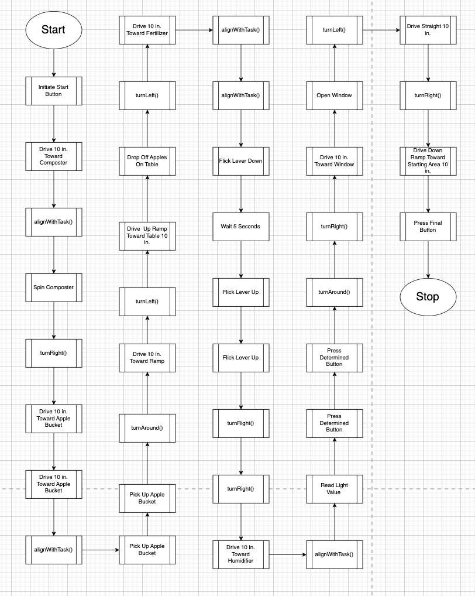

# APP R08-1: Code Representation



The robot follows a sequential process to complete various tasks by navigating its environment and interacting with objects. The logic begins with pressing the start button and moves forward through a series of actions, including driving predetermined distances, aligning with tasks using `alignWithTask()`, turning, and performing the required tasks, like spinning a composter, picking up an apple bucket, and flicking levers.

The robot repeatedly uses `alignWithTask()` to position itself correctly before critical actions. It moves toward various objects such as a composter, an apple bucket, a fertilizer area, a window, and a humidifier. The robot also interacts with buttons and levers, waits when necessary, and reads light values to make decisions.

Toward the end, the robot navigates back down a ramp toward the starting area, presses a final button, and completes its tasks, ending the run.

## **Function AlignWithTask**

The function `alignWithTask(Task task)` is responsible for positioning the robot correctly using its three optosensors—left, middle, and right—to detect and follow lines on the ground. These lines act as guides to ensure the robot aligns itself properly before performing a given task. The function takes a `Task` enum as an input parameter, which specifies the task the robot needs to prepare for. Since different tasks may require different alignment strategies, the function adjusts the robot’s movement accordingly.

### **Function Behavior and Alignment Process**

- The function first checks the readings from the three optosensors:
  - If the `middle` optosensor detects a line, the robot is already well-positioned and may require only minor corrections, depending on the task.
  - If the `left` or `right` optosensor detects a line, the robot must adjust its position by turning slightly toward the center to ensure it is correctly aligned.
- If `none` of the three sensors detect a line, the robot assumes it has lost its position relative to the guiding path. To recover, it will slowly rotate in place, scanning for a line.
- The rotation continues until one of the sensors detects a line. This prevents the robot from drifting too far from its intended path while ensuring it can relocate the guiding line.
- Once a line is detected, the robot stops rotating and stabilizes itself.
- The function then applies task-specific alignment logic:
  - Some tasks may require the robot to align precisely on the middle sensor.
  - Other tasks may require an offset to the left or right, depending on the requirements.
  - The function determines the necessary corrections based on the `Task` argument and executes the required movements.
- After completing the alignment process, the function verifies whether the robot is correctly positioned.
- If alignment is successful, the function returns `true`, allowing the robot to proceed with its task.
- If the robot is unable to detect a line even after rotating for an extended period, the function returns `false`, signaling a failure to align, which may require external intervention.

### **Function Signature:**

```cpp
bool alignWithTask(Task task);
```

- **Input Parameter:**

  - `Task task`: An enumeration representing the task for which the robot needs to align.

- **Return Type:**
  - `bool`:
    - `true` if the robot successfully detects a line and aligns itself correctly.
    - `false` if the robot is unable to find a line and align properly.
