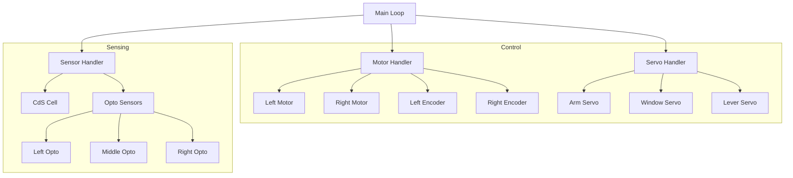

# FEH Robotics Project

## Overview
This repository contains the source code for the FEH Robotics project, developed for the Fundamental of Engineering Honors program. The project involves designing, building, and programming an autonomous robot to complete various tasks on a competition course.

## System Architecture

## Core Modules

### Motor Control (`robot::Motor`)
Handles movement and rotation using encoder feedback for precise positioning.
- Supports forward and backward movement with distance specified in inches.
- Supports in-place rotation with specified degrees.
- Implements battery voltage compensation to ensure consistent performance.
- Includes a line-following algorithm using the optical sensor triad.

### Servo Control (`robot::Servo`)
Provides a high-level interface for controlling the robot's three servos.
- **Arm Servo**: Used for manipulation tasks like picking up the apple bucket.
- **Window Servo**: Controlled movement for specific course interactions.
- **Lever Servo**: Dedicated to interacting with course levers.
- Supports both direct positioning and gradual transitions for smoother motion.

### Sensors

#### CdS Cell (`robot::CdsCell`)
Used for detecting starting lights on the course.
- Identifies RED, BLUE, and NO LIGHT states.
- Utilizes calibrated voltage thresholds for reliable detection under varying lighting conditions.

#### Optical Sensors (`robot::OptoSensor`)
A triad of sensors used for line following and course navigation.
- Detects the presence of a line under the left, middle, or right sensors.
- Supports both straight and curved path detection through configurable thresholds.

## Navigation and Logic
The robot follows a state-based approach for task execution, starting with a light trigger and proceeding through several key tasks:
1. **Composter Task**: Navigating to and interacting with the composter mechanism.
2. **Apple Bucket Task**: Picking up and delivering the apple bucket to its destination.
3. **Lever Task**: Navigating to and flipping the designated levers.

## Physical Configuration
- **Wheel Radius**: 1.375 inches
- **Wheel Span**: 7.5 inches
- **Encoder Resolution**: 172 counts per revolution
- **Voltage Compensation**: Dynamically adjusts motor power based on current battery voltage.

## Directory Structure
- `Robot/`: Primary project directory containing the final source code and documentation.
- `Exploration-*/`: Incremental development steps and experimental code from throughout the semester.
- `Carmen-Assignments/`: Course-related documentation and logic flowcharts.

## Build and Run
The project uses a standard Makefile for compilation.
1. Navigate to the `Robot/` directory.
2. Run `make` to build the project.
3. Deploy the compiled binary to the FEH Proteus controller for execution.